# Ambient Environments
In this module you will get an intro to some of the basic methods for describing and diagramming ambient environments. Additionally you will learn about **"states"** and change dynamically based on **"states"**.

## Diagramming for Ambient Environments
Explaining, designing and engineering products that interact between the physical and digital world can be counter-intuitive. Doing such requires showing interactions that are inherently difficult to see. How do you demonstrate an invisible bluetooth connection triggered by location? How can you capture illusive concepts like time or a sequence of steps  in a single diagram? 

The following are a collection of common diagram types which have helped me explain and design physical-digital interactions. Each diagram type helps explain unique dimensions within the complexity of todays digitally and physically interconnected world.

**Diagram Type** |  What it does |  Example
:-------------------------:|:-------------------------:|:-------------------------:
**Assembly** |  shows how a system’s comprised parts are assembled. This separation of each component part facilitates this understanding and can include additional specifications on dimensions and item ids for each component. Assembly drawings also sometimes include instructions and sequencing as seen in Ikea drawings. |  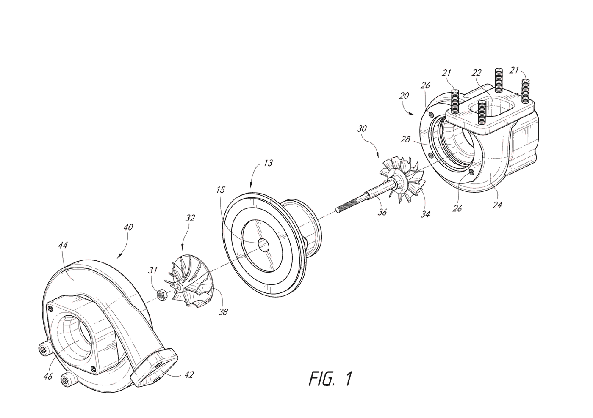
**Rube Goldberg** | show sequence of events in a complicated often impractical contraptions that creates a simple action.|   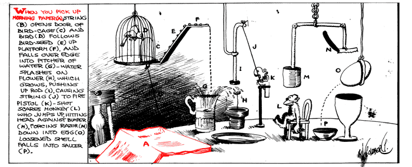    
**Patent** | illustrates a patent invention, and its components. Many patent drawings are also assembly drawings. Patent drawings are heavily notated to describe component pieces, cross referenced in legends and reports. | 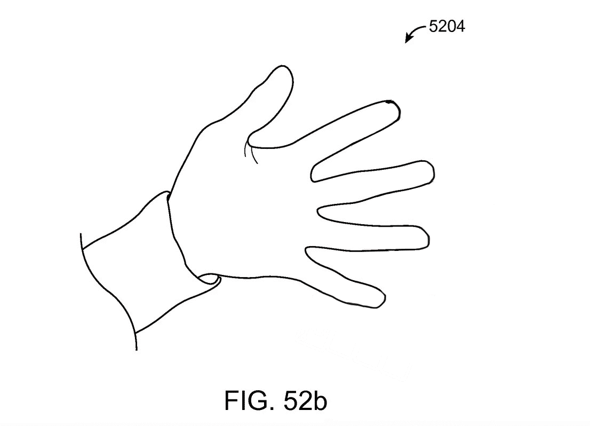
**Tech Stack**  |  shows how software products and programming languages are inter-related to create a web or mobile application. | 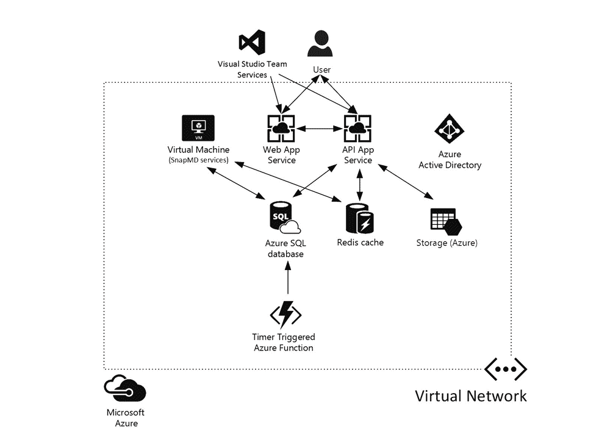  
**Flow Diagram** | shows sequence of movements or actions of people or things involved in a complex system. | 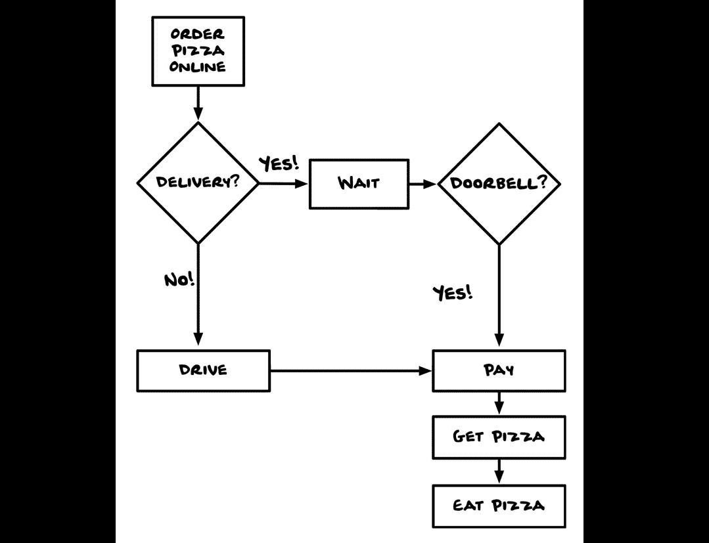
**Decision Tree** | organizes decisions into branches and their possible consequences. |  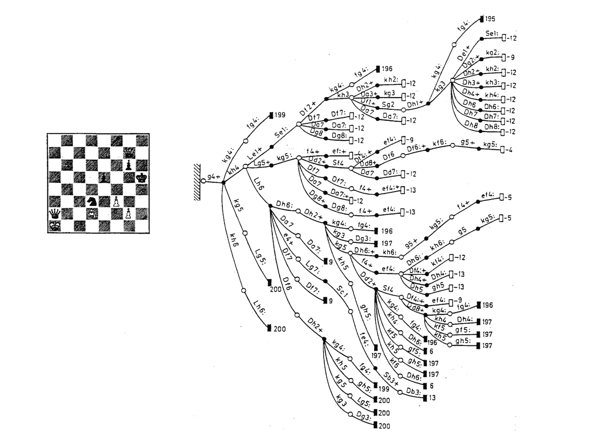  
**User Journey** | explains how an individual user of a particular product or service experiences a series of interactions (touch points) along a journey in aim of a particular outcome from their use of the product or service.|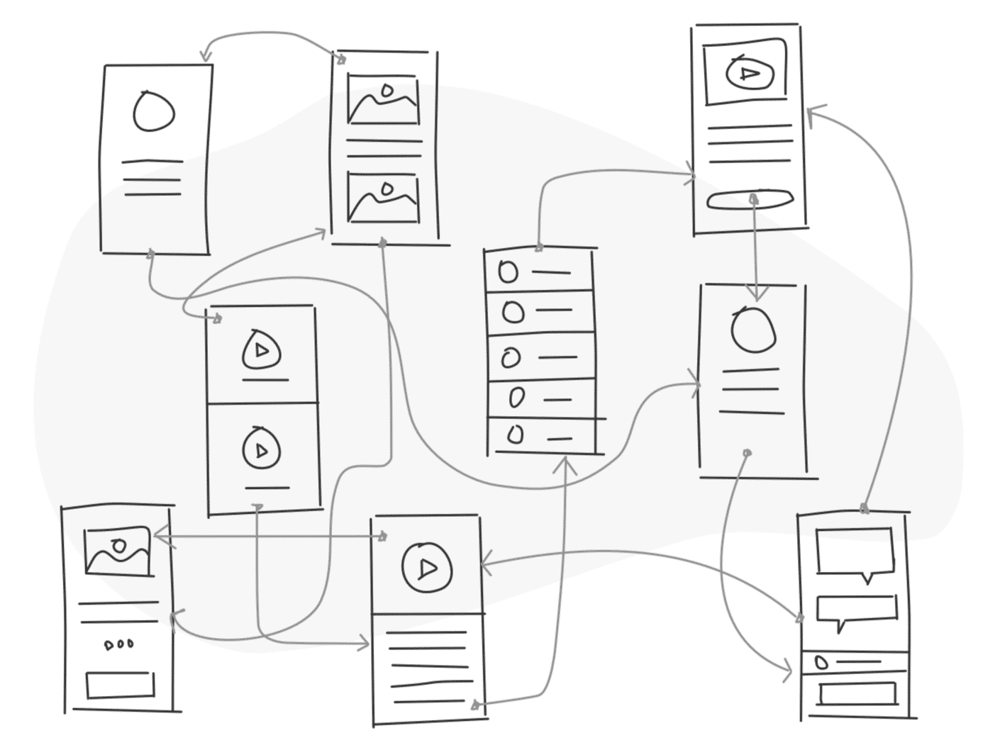 
**User Flow** | show paths in a user interface which a typical user will follow using a website or app. |   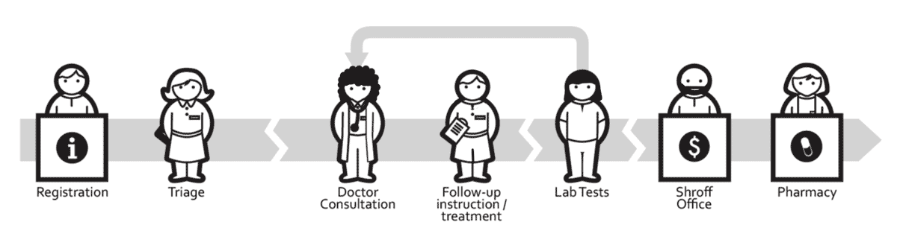  
**Ergonomics** | shows how a product is optimized for the human body, i.e. how its characteristics, such as proportions, weight, responds to the human hearing, sight, temperature preferences, etc. | 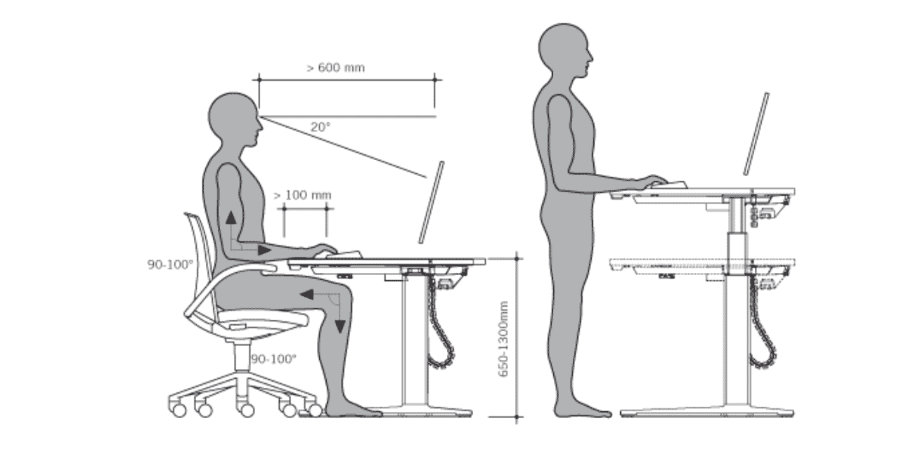 
**Organizational** | shows the structure of an organization/institution/nation and the relative relationships of its people, parts or positions. |  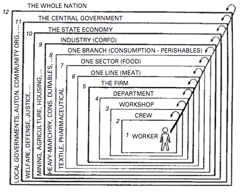  

### Challenge
Sketch a quick diagram (5 minutes) of a room of your own borrowing some of the diagramming techniques from above. Can you capture time? Digital interactions like wifi or bluetooth connections to physical aspects in a space? 

## The New Agency of Physical Places
Cities, places, and physical objects have agency. The curvature of a road is designed for the affordances of a vehicle's turning radius at specific speeds. This large radius isn’t necessary for the quick turning of humans turning the corner at an intersection when they walk along a sidewalk. So the agency, or ability, of space may be intentionally limited to specific types of activities based on its form. An Amazon warehouse is intended for the agility of robots. Spaces in these warehouses are demarcated into human vs robot zones so that human workers are safe and robots can move unobstructed.

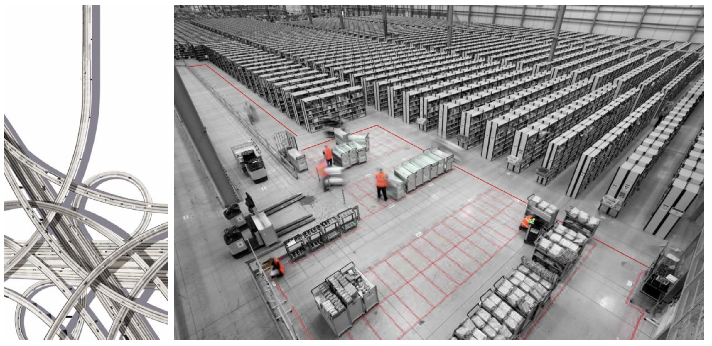 

At smaller scales, physical objects and digital buttons have affordances. A tea pot can be poured whereas a button on a user interface can be pushed. The button cannot be poured, and the teapot is not designed to be pushed between an on/off state. Knobs, dials, joysticks can vary widely in their affordance. Some are intended to provide gradual change while others for binary states.

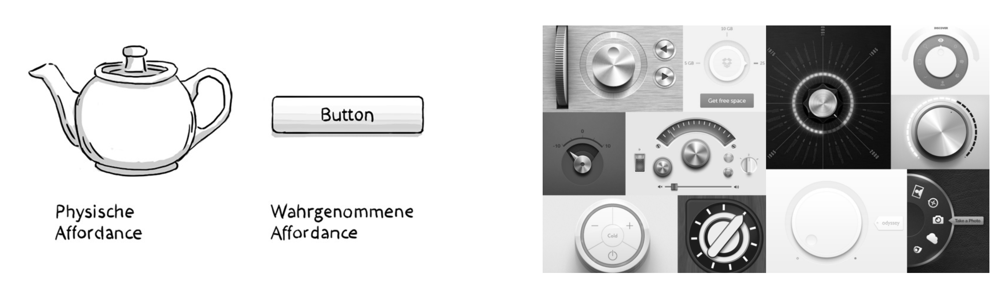 

### Physical + Digital = New Affordance
The combination of both physical and digital systems create new affordances together. In the interaction of hardware and software the sum is often greater than the parts.

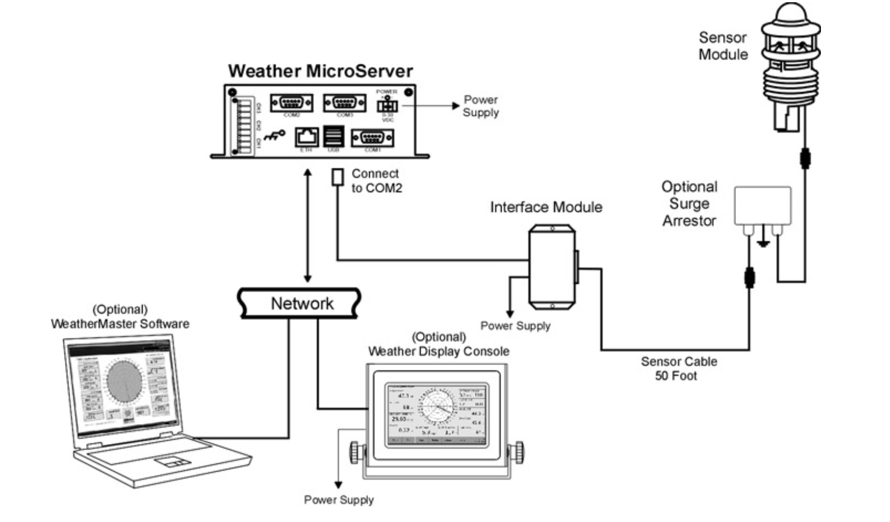 

In Jim Johnson’s Mixing Humans and Nonhumans Together: The Sociology of a Door-Closer, the author points out how the simple invention of a door allows for the state of walls to be both opened and closed allowing for dynamic states:

### "Walls are a nice invention, but if there were no holes in them, there would be no way to get in or out; they would be mausoleums or tombs. The problem is that if you make holes in the walls, anything and anyone can get in and out (bears, visitors, dust, rats, noise). So architects invented this hybrid: a hole-wall, often called a door, which, although common enough, has always struck me as a miracle technology."

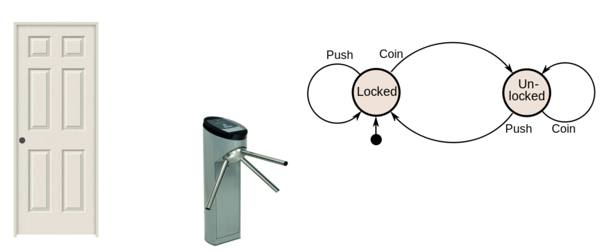 

Today our physical environments are augmented with digital functionality, thus creating new and complex behaviors. This augmentation means its especially important to understand the **“states”** and **“affordances”** of these new environments. Ultimately the behavior and affordance of these environments script human behavior, not just their deceptively simple physical appearances.

### Cities Have Always Been Platforms
The counter at a bar acts as an exchange mechanism between bar patrons and and bartenders. The side in which the person occupies delineates how they should behave. An escalator allows people to move in a direction at a particular speed. Knockers on doors alert people if someone is at the door, but only if they’re in proximity to the door. Simple painted lines on the road will delineate where pedestrians vs cars should move to avoid one another. Trains allow passengers but only if they pass between doorways during the short windows while trains are in stations.

 

Physical spaces operate as networks, much like networks operate on the internet. The size and width of roads allow for speeds of movement. The spatial adjacencies of rooms allow for certain interactions to occur or not.

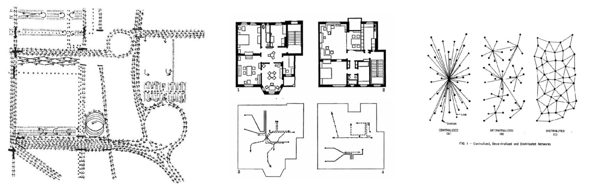 

In Robin Evan’s “Figures, Doors, Passages” the invention of the hallway changed the network of the home, allowing people to “jump” between rooms without passing through others. This dramatically changed the way humans share domestic experiences in daily life. More concerning, this invention was intended to allow slaves and servants to move about the house unnoticed.

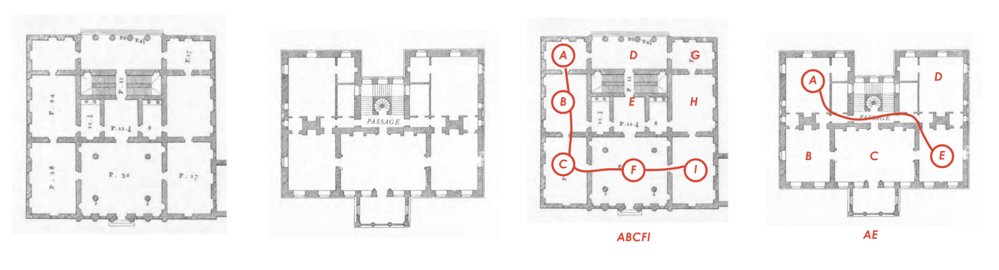 

Rooms have affordances which privilege certain speakers. A lecture hall allows one to speak to many. A courtroom’s height give authority to the judge and jury while those on trial sit lower. A listening circle attempts to create flatter conversation hierarchies.

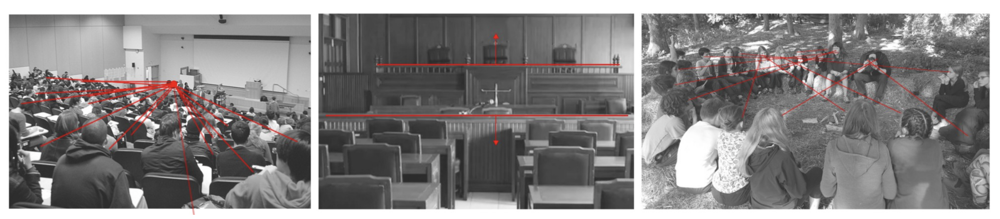 

### Measurement Means Feedback
As measurement of physical space becomes more commonplace, so does the ability to think about how spaces are iterated on and changed over time similar to how websites are A/B tested and changed. The measurement of many physical aspects has historically been difficult, however the premise of “experimenting with physical space” does not come without its dangers of failure.

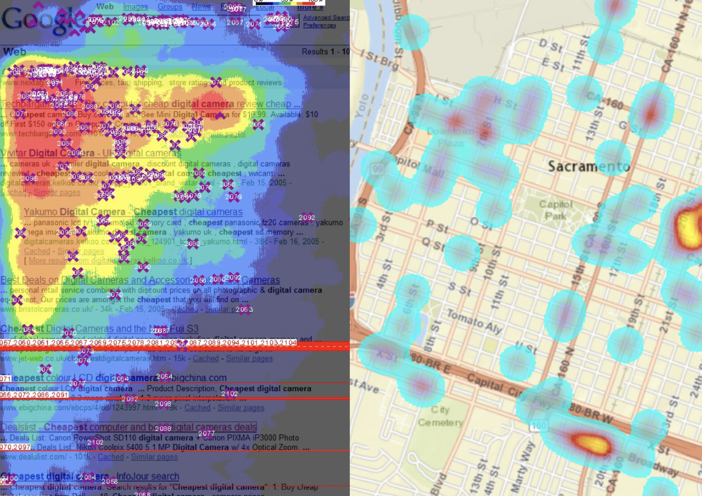 

## Tutorial

1. **Make a diagram.**  
Something something...

