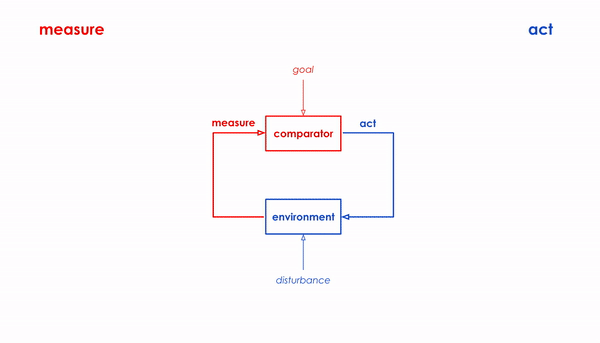

# System Architecture: How Tech Talks
In this module we'll learn about system architecture and how technology talks to other technology. To help understand system architecture we also cover:
- cybernetic systems
- how IFTTT works 
- understand an IFTTT connected system as a cybernetic system
- you will create your first IFTTT recipe

 

### 
IFTTT is an automation tool that lets you easily script actions that link together a wide variety of devices and services. IFTTT is short for "If This Then That," a programming convention that defines in a nutshell how the service works. The "if this" part is known as the trigger, and "then that" is the action. IFTTT is a useful tool for creating new network architecture.

1. Go to [IFTTT](https://ifttt.com/home)
2. Go to `Explore` → here you will see many premade IFTTT recipes: e.g. if a 
3. Go to `Create` → to create a new application
4. click on the **“this”** to choose our trigger. Search for **“webhooks”**. Select `webhooks`.

### How IFTTT Maps to a Cybernetic Feedback Loop
IFTTT breaks everything down into `triggers` and `actions`.
We will think of this through the framework of **measure** and **act**.

 

### How IFTTT talks to services.
IFTTT talks to services (i.e. TP-Link Kasa, or Wireless Tag). The service then talks to its hardware products. For example the Wireless Tag service talks to its tag manager and temperature sensors.

 

## Tutorial
### Brainstorming Measure/Act
To get some ideas flowing on a Measure →Act system, we will create a bunch of measures (triggers) and a bunch of acts (actions) on index cards. Then we will mix and match them randomly to chain together new interactions we may not have thought of. We will trade our cards with others who have done the same to think of new ideas together.

 

### Naming State Machines
Next we will select a few of our Measure → Act systems then come up with names for the system. By naming the system it will facilitate understanding a goal of the system. While naming the system, we should also add in any needed detail of conditional aspects or thresholds that clarify the system. For example for email state → change pace light, I will change it to if more than 5 unread emails → increase light pulsing, then I will name it “Worker Waver”. Here are some examples below.

Title — `measure (trigger)` → `act (action)`
- Ego-Grower —instagram mention detected → water plant
- Flag-Planter — room occupied → post something on social media
- Digital Food— store closed → order groceries from Prime Now
- Money Squasher — pumpkin spice season → unlock piggy bank
- Jupiloop — Jupiter’s location closer→ project yesterday’s video
- Lunar Light — full moon → project image of moon
- The Lazy Way —ask about the weather → send me pizza
- FOMO talk — speech detected → play live feed of outside
- Off the Beaten Path — if off beat → move sound across room
- Throwing Shade — louder → move shadow
- Gender Balance Alert — gender variety in meeting low → send email
State Feedback Loop → image change (image dif) → play video
- Umbrella — raining → remind me with an event
- Laptop Aided Mtg Room — 2 chairs available → turn power on
- Cool Cave — dark → turn fan on
- Pyro — flame detected → turn airblow dryer on
- Light Leveler — bright → turn light off
- School Focal Zone — fall season → spot light on desk
- Party Bot — 3:00 pm Friday → send party invites
- Beep Buddy — friend is close to room → beep
- Flushee — new person inside my house → flush the toilet
- Mother May I — location close to downtown → call mom
- Worker Waver — more than 5 unread emails → increase light pulsing
- Calming Move — detect motion → turn lights down
- Cool Light — temperature increase → make color temperature cool
- Outdoor Prep — front door is open → zoom in on video outside
- People Counter — new face detected → make a log of the event

 

 

Concept from cybernetics about measurement and feedback.

Take a stance that we should see buildings as ongoing living systems to be designed and changed. How should standards continually adapt?
Architects have this long problem - when they design buildings they have to wait decades before they understand how it all pans out - so they use models to predict how a building or neighborhood will behave
But you can’t really program and deploy changes to smart home products so quickly - you need to have immense programming experience to build something like an Amazon Echo
Arduinos however are much easier to program - they are much easier to understand and program
Finally microservices like IFTTT allow you to program and prototype applications in human readable language

Whats interesting about this to me is that Individuals can deploy and test changes that will immediately influence their behavior

Where it once required a monolithic application to program something
Now with “End User Programming” you can just prototype something on the fly with a short sentence that is strung together to longer programs
This can fundamentally change who has agency.

## Tutorial
1. Sign in to IFTTT or create a new account.
2. Select the `Get more` button in the upper right hand corner.

 

3. Select the `+` button underneath the `Search bar` on the righthand side
4. Select an application from the `+` between “If” and “This”

 

5. Select a trigger `service`
6. Sign up for the service if you do not already have the service. Note you may choose to use a service you already have for convenience. Alternatively for security you may choose instead to create a new service account with a unique email to keep your primary accounts disconnected from IFTTT.

 

7. Choose a trigger
8. Select the fields for your trigger, and select `Create trigger`

 

9. Select the `+` between the “Then” and “That”. You’ll notice an icon for the first `+` has been replaced by an icon for the `trigger service` we’ve connected to.
10. Select an action service
Sign up for the action service if you have not yet, if you are already signed up you will be taken directly to choosing the action.

11. Choose the action
12. Fill out the action fields and select create action

 

13. Ensure your recipe looks correct and select `Finish`
14. This is now stored as a saved recipe on `My Applets`

 

 

 
