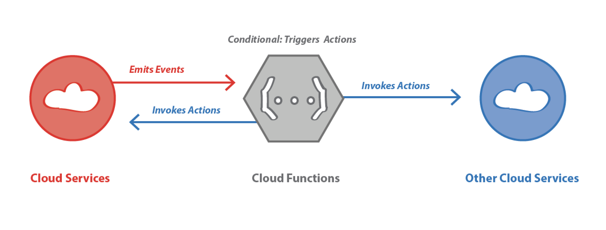
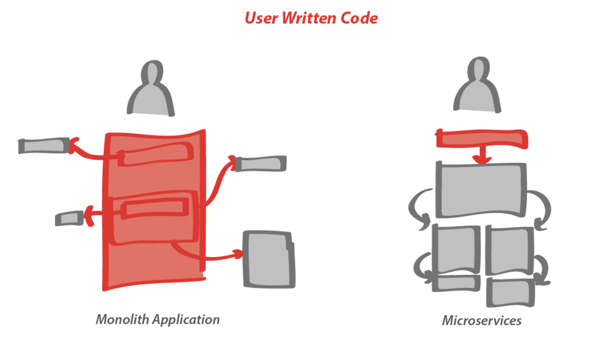
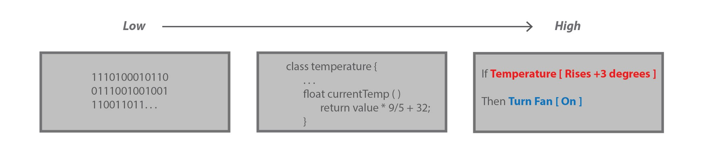
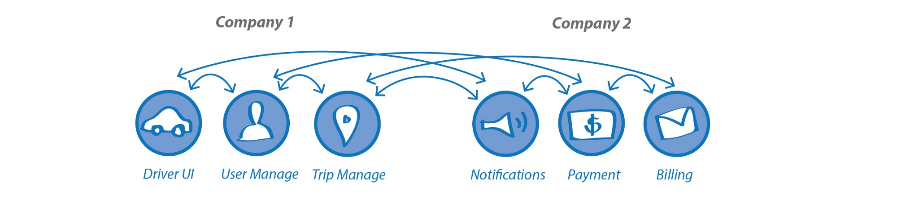
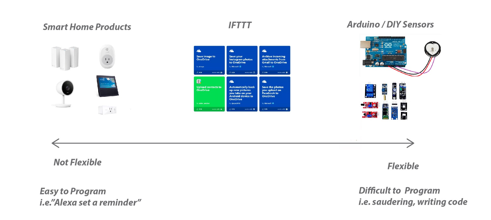

Ambient Computing:
===========================================

# Low and High Programming
## Module Summary

### Out of the Weeds and into the Clouds: Microservices

Today cloud services and standard data protocols have created a big shift from large monolithic software products to smaller series of modular component applications called microservices that run on the cloud.

The shift towards these smaller components enables a few important things that spatial designers should be aware of:
- **Lowering Barriers to Entry** — It allows a non-technical user to create new applications with only the need to write tiny code snippets that execute one function rather than writing entire programs and worrying about servers and API protocols.

- **From “in the Weeds” to “in the Clouds”** — Services like IFTTT allow designers to design with more visual higher level abstractions of low level code. Moving from low level to high level programming means spending less time programming nitty gritty components to thinking about how services and actions interrelate and what outcomes they drive.

- **Shared Resources** — Bite size components allows companies to more easily exchange applications, reducing redundancy between companies and the need for building proprietary applications. Allows companies to build off of others work, rather than building from scratch.

### Microservices For Designers
Microservices makes it easier for designers to play with design ideas because it allows for a wider ability to innovate then off-the-shelf monolith services without falling into a zone that becomes to onerous to program.

### Terms to know:
**microservices** — application development where a large application is built as a suite of smaller modular services. On IFTTT Wireless Tags, Phillips Hue Lights, Amazon Echo, etc. are examples of microservices.
**Functions as a Service (FaaS)** — Smaller still than microservices, FaaS uses small code snippets of specific functions to execute a tiny portion of a service. In IFTTT, this is done by creating recipes and writing single functions such as “If the temp > 72 degrees, then turn on the fan”.
**Everything as a Service (XaaS)** — Shifting from selling products to selling capabilities can be complex and resource-intensive. customize their computing environments to craft the experiences they desire.
