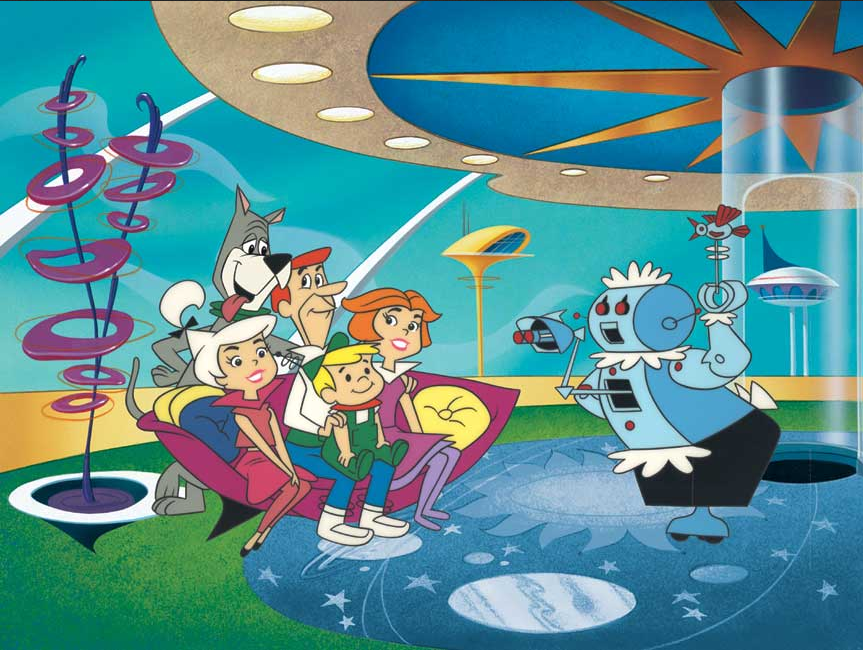
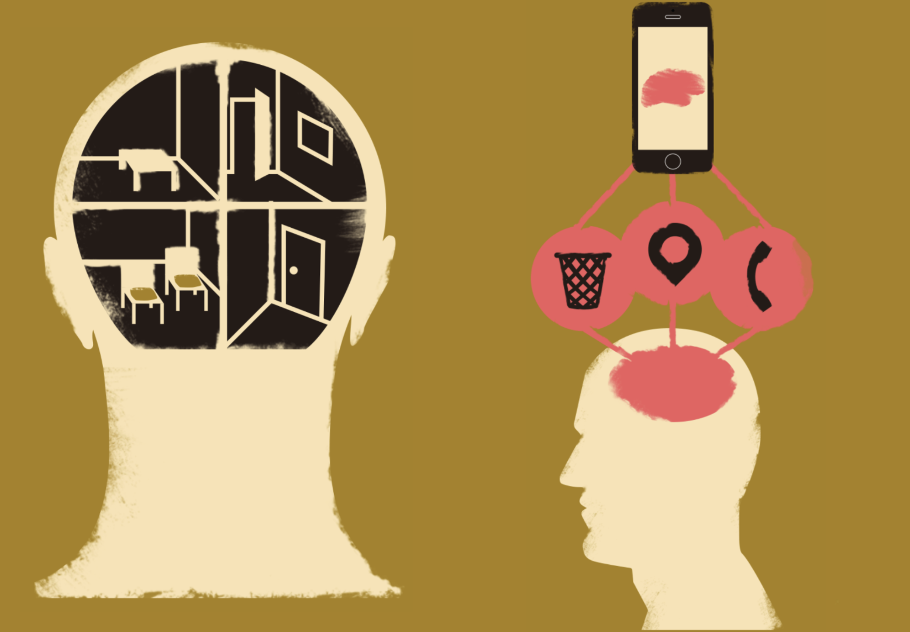

# Sounds, Speech and Macros
In this module you will learn how to work with sound in processing: 
- playing an audio file
- using the microphone
- using speech

## Sound is fundamental to ambient environments
Audio and speech are critical aspects to ambient environments. Because sound does not require our visual attention it has been the go-to interaction mechanism for smart home devices. 

### Companies investing in speech and audio
Today's major technologies from Amazon, Apple, to Google have invested heavily in audio and speech based commands because it extends as the primary mode for triggers and actions in an ambient environment: take for example Amazon Echos, Apple's Siri, and the Google Home. Each of these relies on a microphone and software to understand the spoken command, then responds to the command with a speaker. Consider the almost eerie level of this human-esk conversation between a person and their smart home system depicted in Amazon's patent for the Echo.


### Why sound is a great communication mechanism for ambient environments 
Sound lends itself to ambient environments. It does not require the same visual attention that a screen or display does. You can hear something in the background to pick up the information that is shared by that sound. It is also easy to move about a space and still hear a sound. Additionally, speech also lends itself well to many people. Take for example the training required to show someone how to enter a command on a computer, vs training someone to speak to their smart home device. Most people already know how to speak. This makes speech based systems well suited to a broader base of people. 
Consider the amount of attention required for a visually based system:


### Ethical considerations for smart home systems

privacy           |  assumptions of race and gender in service |  reliance on technology
:-------------------------:|:-------------------------:|:-------------------------:
  |    |  

### Inspirational projects


Below are some examples of artists using sound in Processing in their own work:
[Sound Translator](https://vimeo.com/groups/processing/videos/3102434)


## Playing Sounds 
1. From Processing go to `Sketch` → `Import Library`→ `Add Library` → search for **“sound”** and select `Sound` | Provides a simple way to work with audio → and click ↓ Install.

2. Now in your Processing sketch copy in the following code from the codeblock below. If you get stuck, you can also [download the full sketch from here](https://drive.google.com/file/d/11ST40zIHw7ZzOZd78WWhkX1thc2AmTmv/view).
Do not press play just yet! The code below 
* imports the sound library
* draws a canvas and sets the background to white
* imports a sound file named "stampede" (we have not yet added this sound file, so our code will not yet know what to reference until we have added a sound file to our Processing folder), then plays the file
* changes the volume


```java
import processing.sound.*;
SoundFile file;

void setup(){
  size(800,800);
  background(255);
  
  //this loads the file based on the file name
  file = new SoundFile(this,"stampede.aiff");
  file.play();
  
  //this changes the volume level (number between 0 and 1)
  file.amp(.5);
}
void draw(){
}
```


3. Now lets add a sound file (.wav file or .aifff) to your Processing sketch folder so that we can play a sound.
You can download [stampede.aiff here](https://drive.google.com/file/d/1TqHKS2-ed6b8mZc2pdsVgqyfONrGB6X-/view) or download [goat.wav here](https://drive.google.com/file/d/1Ra762fHMZ8bI-FrBlADfrF5T7oVHFzvV/view). These are the sound files we would like Processing to play.  

4. Save your Processing sketch. The name of your Processing folder must match the name of your Processing sketch as shown in the image below.
Drag and drop the sound files you’ve just downloaded into your sketch folder as shown in the image below. Now when you press play from Processing your sound file should play.


5. You can find more free sounds by creating an account at [https://freesound.org/](https://freesound.org/) and downloading your own files that you would like to play.

### Challenge
- Level beginner - can you change this script to use another sound from [https://freesound.org/](https://freesound.org/)?
- Level intermediate - can you have the sound change between multiple sound files based on the position of your mousee? 

## Listening to Your Mic
To listen to the mic on your computer copy and paste the text from below. You can also download this Processing file directly from here.
```java
import processing.sound.*;
AudioIn input;
Amplitude analyzer;
void setup() {
  size(200, 200);
// Start listening to the microphone
  // Create an Audio input and grab the 1st channel
  input = new AudioIn(this, 0);
// start the Audio Input
  input.start();
// create a new Amplitude analyzer
  analyzer = new Amplitude(this);
// Patch the input to an volume analyzer
  analyzer.input(input);
}
void draw() {
  background(255);
// Get the overall volume (between 0 and 1.0)
  float vol = analyzer.analyze();
  fill(127);
  stroke(0);
// Draw an ellipse with size based on volume
  ellipse(width/2, height/2, 10+vol*200, 10+vol*200);
}
```

[](https://youtu.be/5f6nnXDe4Aw "Listening to Your Mic")

### Challenge
- Level beginner - can you change this script to change the color of the ellipse based on the volume of the sound?

## Text to Speech
**Getting A Mac Laptop to Speak**  
Processing can execute commands outside of Processing. On macs we can make our computers do speech to text:

```java
void setup(){
  exec("say", "hello");
}
```

You can also use one of your Mac’s these unique voices:
`Alex`, `Alice`, `Alva`, `Amelie`, `Anna`, `Carmit`, `Damayanti`, `Daniel`, `Diego`, `Ellen`, `Fiona`, `Fred`, `Ioana`, `Joana`, `Jorge`, `Juan`, `Kanya`, `Karen`, `Kyoko`, `Laura`, `Lekha`, `Luca`, `Luciana`, `Maged`, `Mariska`, `Mei-Jia`, `Melina`, `Milena`, `Moira`, `Monica`, `Nora`, `Paulina`, `Samantha`, `Sara`, `Satu`, `Sin-ji`, `Tessa`, `Thomas`, `Ting-Ting`, `Veena`, `Victoria`, `Xander`, `Yelda`, `Yuna`, `Yuri`, `Zosia`, `Zuzana`

```java
void setup(){
  exec("say", "-v", "Karen", "hello");
}
```


**Speaking to the Amazon Echo**
You can also make a Mac speak to an Amazon Echo:

```java
void setup(){
  exec("say", "Alexa, what time is it");
}
```
Or ask your echo to execute other services:
```java
void setup(){
  exec("say", "Alexa, turn off the lights");
}
```
Check the links below for a list of arguments you can use with these different smart home systems:
- [Amazon Echo Commands](https://www.cnet.com/home/smart-home/every-alexa-command-you-can-give-your-amazon-echo-smart-speaker-or-display/)
- [Google Home Commands](https://www.the-ambient.com/guides/best-google-assistant-commands-382)

[](https://www.youtube.com/watch?v=JoRS7By8JEU "Listening to Your Mic")

### Automated Language
Finally if you want to think more about creating custom phrases you may want to understand more about what are called strings. Strings are a data type used in programming, such as an integer 6 a float 6.2, but is used to represent text rather than numbers, i.e. This is a string but 6 can also be a string. To learn more about strings and text in Processing check out this video tutorial:
[Strings and Drawing Text - Processing Tutorial, Daniel Shiffman](https://www.youtube.com/watch?v=NLzne4XaR3M)

**Making Bots**
JSON format is particularly useful for auto-sentence generation because its dictionary format links words with keys which we can use as categories. The [Corpora project](https://github.com/dariusk/corpora/tree/master/data) is a great spot to find word lists already formatted as JSON.

### Projects that Use Bots
[As cynical start-up idea generator](https://twitter.com/BodegaBot), Darius Kazemi
[As poetry maker](https://twitter.com/the_ephemerides), Allison Parrish
[Magic Realism](https://twitter.com/MagicRealismBot), Kate Compton

### Projects that Use Sound


Could you play with the idea of who is speaking in a room, and direct light towards them?
https://vimeo.com/groups/processing/videos/3102434
