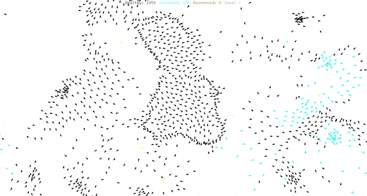

Behavioral Modeling Intro:
===========================================

# Unity Intro and Agent Based Modeling
## Module Summary

In this intro you will learn how a basic agent based model works as well as its origins.
Additionally you will get an intro to the Unity interface.

## Conceptual Introduction
Most computational modeling describes a system in a state of equilibrium in some resting state or in a single moment. Agent based modeling tries to understand a system as dynamic. With a few rules applied across multiple individual acting agents, complex patterns emerge. If we imagine our spaces (cities, parks, homes, etc) are dynamic and flexible, the choreography of how a system like a city or a home changes is important. Does zoning and building program have to be static, or can we choreograph the use of a city by modeling and intervening in its dynamic agents?

Today, new technologies and methods are emerging for exploring and visualizing urban complexity through these many systems and invisible dimensions. Urban planning simulation, economic modeling, traffic simulation, operations research, and agent-based modeling comprise the new tools. Open data platforms and web based gaming applications give immense power to designers, researchers and engineers to create their own simulations.

- [The Complexity Explorer](https://www.complexityexplorer.org/)   
- [Examples of ABMs](http://www.complexity-explorables.org/explorables/)

### Agent Based Models
An agent-based model (ABM) is a class of computational models for simulating the actions and interactions of autonomous agents (both individual or collective entities such as organizations or groups) with a view to assessing their effects on the system as a whole. [ref Wikipedia]
ABMs are an artificial representation of the world. They are a subjective view of how systems interact based on the encoded rules, interactions and systems an author chooses to represent.

A standard architectural Rhino model focused on the physical form at a fixed moment in time. Focused on the **noun** so-to-speak of the built environement. 

An agent based model focused on the flows, growth and movement over time. Focused on the **verb** so-to-speak of the built environement. 

While not a realistic representation of reality, agent based models can help us understand our world by creating simplistic models to test assumptions. Even from simple rules we can test how many complex behaviors emerge when these rules are applied to many agents. For example a simple rule to have a bird follow another bird within a short proximity to one another, creates complex clustering and swooping behavior that mimics a flocks of birds.

How birds flock togeether:

description of an individual agent:

example of emergent behavior when multiple agents act together creating the flocking behavior:

### Game Theory
Agent based models have also been applied in the field of economics (especially macro-economics) to understand how people might make decisions given various conditions and behaviors. One of the most important aspect is that individual agents when compounded have emergent behaviorsnot apparent when viewed alone. In game theory this means the outcome of decisions cannot be understood by looking at how individuals make decisions alone. Instead you must take into account how an individual will make a decision taking into account that they are aware of how others will make decisions. An example of this is the Prisoner’s Dilemna.
“I feel, personally, that the study of experimental games is the proper route of travel for finding the ‘ultimate truth’ in relation to games as played by human players.”
John Nash, The Agencies Method For Modeling Coalitions and Cooperations In Games

## Tutorial
### Components of an Agent Based Model
- **individuals (agents)** — could be humans, parcels of land, vehicles, animals, etc
- **environment** — framework in which the interactions occur, i.e. a city, a neigh

rhood, a floor plan, a room, etc
- **behavior** — the procedural rules that define how the individuals behave — i.e. a person move away from other people if a space gets crowded, or a person may be attracted to other people with particular characteristics, etc
- **parameters** — characteristics of the agent — i.e. a agent that is a person might have speed, size, distance the agent will stand next to other agents, etc
- **input** — parameters that globally drive the model — i.e. population size of your agents, climate or location for your environment, or other data that is put into the model
- **output** — global parameters that are the outcome of running your model

While we can recognize that these simulations are replicas of reality, the aim of simulation should also be to make our assumptions and biases explicit and testable, moving assumptions out of the black box of hidden algorithms. By clearly defining the elements of a simulation, assumptions can be vetted.

Open simulation tools can extend agency to people outside of a disciplinary expertise. Gaming platforms can combine simulations across disciplines and have intuitive user interfaces that allow anyone to participate in rulesets usually encapsulated in an industry’s specific modeling technique and software.

### Unity Intro

